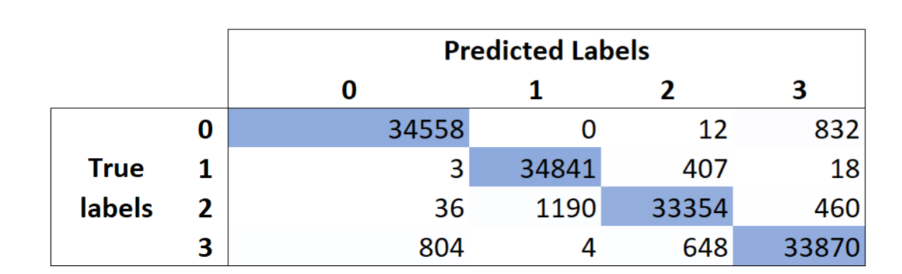

Challenge 2: Apprentissage Supervisé

Ricardo FERNANDEZ | Sarra MAHMOUDI | Chenjie QIAN | Soumiya RAZZOUK | Daniel TERAN
# **1. Statistiques descriptives et feature engineering**
## **Loading and cleaning**
Nous avons commencé par importer nos données, et les rassembler dans une base de données df en ajoutant les colonnes Instance name et Solution cost. 

Nous avons constaté que la colonne ‘S7’ n’a pas été calculée, nous l’avons supprimé de la database. 

Nous avons vérifié que df ne contient aucune valeur nulle et après nous avons choisi de supprimer toutes les variables statistiques ‘S2’, ‘S4’, ‘S6’, ‘S14’, ‘S15’, ‘S17’, car elles seront fortement corrélées avec les autres variables.

Une analyse des corrélations a montré une grande corrélation entre ‘S12’ et ‘S13’ (coefficient = 1), quitte à supprimer ‘S13’. Et les corrélations suivantes : 

À ce stade, afin de mieux appréhender les différents comportement des données, nous avons procédé à leur normalisation.

## **Sampling the data**
Le volume de notre data requiert de choisir un échantillon à étudier. Une comparaison statistique entre différents échantillons de 99%, 10%, 5%, 1%, 0.1%, 0.01% montre que même un échantillon de 0.01% sera représentatif de notre data et qu’on va perdre l’information.

Pour cela, **nous avons sélectionné 0.01%** de chaque fichier csv et nous avons combiné les datasets comme avant.

# **2. Benchmark des méthodes de régression pour prédire le coût d’une solution d’un problème CVRP**

Pour répondre à la question de prédiction de la variable coût, nous avons utilisé différents modèles de régression, et nous avons procédé par comparaison des performances pour sélectionner le modèle le plus performant en termes de généralisation. Nous avons divisé notre échantillon en 80% pour l'entraînement et 20% pour le test. Et pour tester la capacité de généralisation de nos modèles, nous avons utilisé la cross-validation.

**Définition des métriques utilisés :** 

RMSE (Root Mean Squared Error) - EQM racine carrée , MAE (Mean Absolute Error) - EAM, MSE (Mean Squared Error) - EQM. R-Square score (Coefficient de détermination)

Le tableau ci-dessous résume les résultats de notre étude : 

Le graphe ci-dessous, établit une comparaison entre les modèles : 

A partir du graphe et du tableau, on remarque que tous les **modèles utilisés font de bonnes prédictions et peuvent généraliser** la connaissance sur de nouvelles données de Test. Et on retient **Convolutional Neural Network, Random Forest et XGB Regressor comme modèles les plus performants (Voir Jupyter Notebook).** 
# **3. Transformation en un problème de classification**

Nous réalisons un **échantillon plus grand (25%)** pour explorer la distribution des données et sélectionner la meilleure alternative pour la classification et la répartition des étiquettes. L'échantillon **prend en compte le groupe auquel l’instance appartient** (soit 2113, 2213, 3113 ou 3213). Aucune valeur manquante n'a été trouvée, donc nous procédons à normaliser l'échantillon.

Dans le processus de normalisation, nous décidons d'utiliser un **MinMax normalizer,** en choisissant le meilleur résultat comme 0 et le pire comme 1, et de le répartir à travers chaque groupe, étant donné que les conditions sur chaque regroupement étaient différentes. Ainsi, si nous voulons un modèle généralisable, nous devons standardiser chaque partie de données individuellement avec ses maximums et minimums respectifs, **en considérant que le coût de la meilleure solution est le plus petit.**
## **Categorization rules**
Après avoir exploré les données et les boxplots, nous décidons d'établir une **règle basée sur les quartiles**, étant donné que les données sont normalisées. Nous proposons donc d'avoir 4 catégories:

Après avoir exécuté quelques modèles, nous avons constaté que les **résultats étaient biaisés** en raison des classes déséquilibrées (par exemple, une précision de 98 % pour "Excellent" et une précision de 60 % pour "Bad"). Comme l'erreur était proportionnelle à la quantité de données, après avoir équilibré les classes, nous avons obtenu de meilleurs résultats. Par conséquent, nous avons décidé de le maintenir en tant que partie intégrante de la stratégie principale.

Le rééquilibrage a été effectué en prenant comme référence la quantité de données de la classe "Excellent" afin d'obtenir le même nombre dans les 4 classes. En conséquence, chaque classe compte désormais 176 296 valeurs. Comme cela, **on a obtenu des meilleurs résultats en appliquant les modèles de classifications** qui sont montrées ci-dessous
## **Classification models**
Nous avons mis en œuvre deux modèles de classification différents **: Random Forest et Régression Logistique.** Les valeurs de "Solution Cost", "Cost Category" et de l'instance sont retirées, car les valeurs des "S" ont déjà été normalisées par catégorie et parce que, évidemment, la catégorie de coût a un poids important dans la classification et introduit un biais.

Voici les résultats de l'évaluation de la classification par méthode :

En conséquence, les modèles présentent d'une part une **haute précision dans les 4 catégories**, avec également un indicateur *recall* signalant une performance élevée dans l'attribution des cas positifs. De même, **le modèle *Random Forest* affiche des performances plus élevées et plus cohérentes** que la régression logistique.

Pour explorer la construction du modèle de Random Forest, la propriété “feature importance” indique que les caractéristiques les plus importantes pour le modèle sont S5 et S11, suivies de S8 et S16. Ceci est cohérent avec les résultats de PCA de la première partie.

### **Model Validation**
Pour constater les modèles, **la matrice de confusion** montre la quantité des données bien classifiées et mal classifiées qui est cohérente avec les résultats des mesures du modèle. 

Il sont remarquables les erreurs faits dans [Predicted Labels: 0, True Labels: 3] et vice versa, Predicted Labels :3 et True Labels: 0 ].

**Cross validation:** En effectuant une validation croisée manuelle et en sélectionnant un échantillon aléatoire différent avec une plus grande portion de données, il est possible d'évaluer la généralisation de la méthode avec les résultats suivants

**Conclusion :** 

Nous avons abordé le problème du CVRP, utilisant des solutions générées par une variante d'algorithme génétique. L'objectif final n'était pas de résoudre le problème directement, mais plutôt de développer des modèles de prédiction de la qualité des solutions.

Dans notre approche, nous avons commencé par une phase de statistiques descriptives et de feature engineering, cherchant à comprendre la structure des données et à recoder, transformer, voire créer de nouvelles variables pertinentes. Ensuite, nous avons entrepris un benchmark des méthodes de régression pour prédire le coût des solutions CVRP. En explorant des techniques telles que la régression linéaire, Support Vector Regression, Arbres de régression, Random Forest, Gradient Boosting, et même les Réseaux de Neurones, nous avons cherché à obtenir le meilleur modèle en termes de généralisation sur un ensemble de test. 

La phase suivante a été une transformation du problème en un problème de classification. En introduisant une nouvelle variable représentant la qualité de la solution ‘Cost\_category’ sous forme catégorielle, nous avons repensé notre approche pour prédire la qualité globale des solutions. Et sur les deux problèmes (régression, classification) nous nous sommes basés sur la validation croisée pour vérifier que nos modèles ont bien des capacités de généralisation. 
